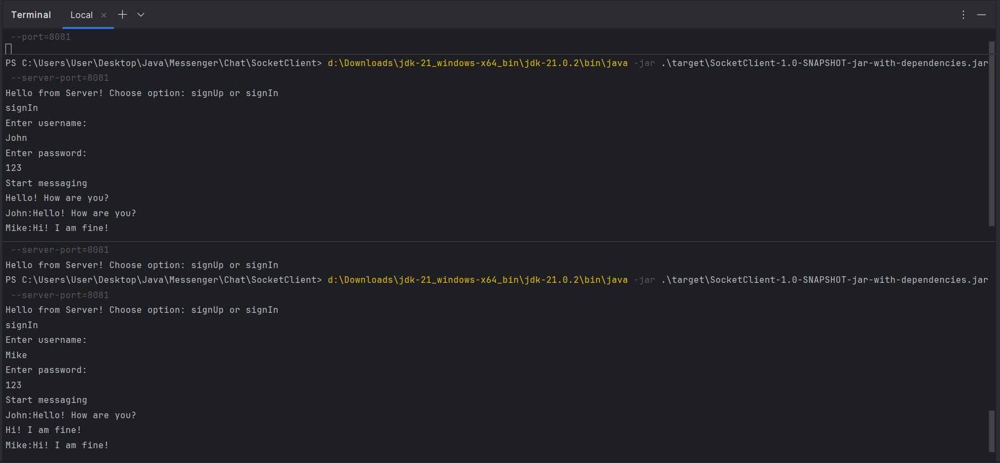

# Messenger
Messenger

# Multi-User Chat Application

Это приложение реализует основу много-пользовательского чата с поддержкой регистрации, входа в систему, отправки сообщений и выхода из системы. Приложение хранит сообщения в базе данных с указанием отправителя, текста сообщения и времени отправки.

## Жизненный цикл пользователя в чате

1. **Регистрация**: Пользователь регистрируется в системе.
2. **Вход в систему**: Пользователь авторизуется. Если пользователь не найден, соединение закрывается.
3. **Отправка сообщений**: Каждый пользователь, подключенный к серверу, получает сообщения в реальном времени.
4. **Выход из системы**: Пользователь может выйти из системы.

## Хранение сообщений

Каждое сообщение сохраняется в базе данных и содержит следующую информацию:

- **Отправитель**: ID пользователя, который отправил сообщение.
- **Текст сообщения**: Основное содержание сообщения.
- **Время отправки**: Время, когда сообщение было отправлено.

## Как тестировать

Для всестороннего тестирования рекомендуется запустить несколько jar-файлов клиентского приложения, чтобы имитировать работу нескольких пользователей.

Пример работы программы:

---

Запуск приложения и взаимодействие с пользователями через консоль позволят увидеть, как система обрабатывает регистрацию, вход, обмен сообщениями и выход.
